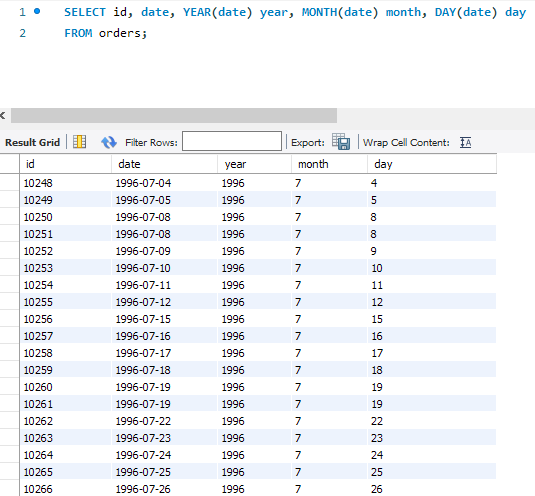
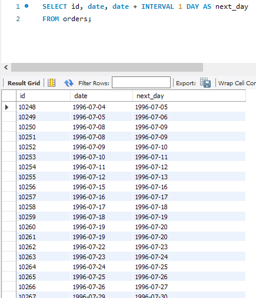
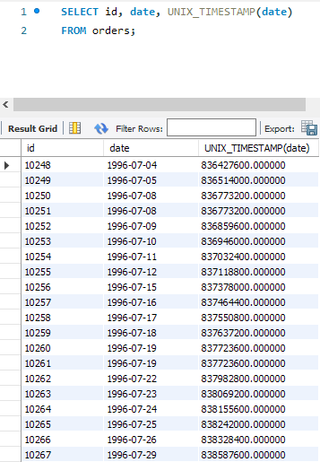
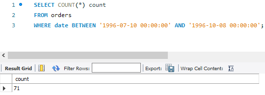
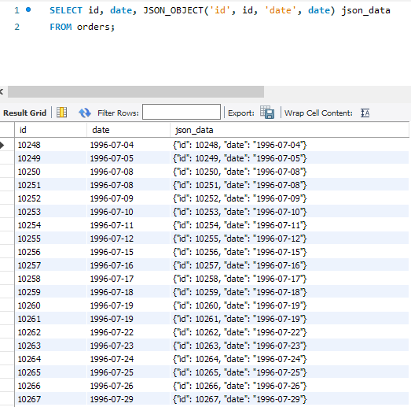

# Relational Databases Date Time JSON Functions HW-07

## P1

```sql
SELECT id, date, YEAR(date) year, MONTH(date) month, DAY(date) day 
FROM orders;
```



## P2

```sql
SELECT id, date, date + INTERVAL 1 DAY AS next_day  
FROM orders;
```




## P3

```sql
SELECT id, date, UNIX_TIMESTAMP(date) 
FROM orders;
```




## P4

```sql
SELECT COUNT(*) count
FROM orders 
WHERE date BETWEEN '1996-07-10 00:00:00' AND '1996-10-08 00:00:00';
```




## P5

```sql
SELECT id, date, JSON_OBJECT('id', id, 'date', date) json_data
FROM orders;
```



